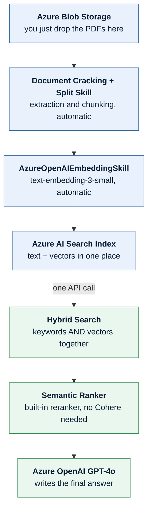

# Table of Contents

- [**End to End Embedding Steps**](#end-to-end-embedding-steps)
  - [Step 1: Document Extraction](#step-1-document-extraction)
    - [Code Example: Read the PDF](#code-example-read-the-pdf)
  - [Step 2: Chunking (Slicing the Cake)](#step-2-chunking-slicing-the-cake)
    - [Code Example: Split the Text into Chunks](#code-example-split-the-text-into-chunks)
    - [How to Decide Chunk Size (Paragraph Length)](#how-to-decide-chunk-size-paragraph-length)
      - [Code Example: Pick a Preset, Then Count the Tokens](#code-example-pick-a-preset-then-count-the-tokens)
    - [How to Decide Overlap Size (The Safety Net)](#how-to-decide-overlap-size-the-safety-net)
      - [Code Example: See Overlap With Your Own Eyes](#code-example-see-overlap-with-your-own-eyes)
      - [Simple Starting Point](#simple-starting-point)
  - [Step 3: Embedding (Translating into Numbers)](#step-3-embedding-translating-into-numbers)
    - [Code Example: Turn Chunks into Vectors](#code-example-turn-chunks-into-vectors)
    - [How to Choose: `text-embedding-3-small` vs. `text-embedding-3-large`](#how-to-choose-text-embedding-3-small-vs-text-embedding-3-large)
      - [Choose `text-embedding-3-small` if:](#choose-text-embedding-3-small-if)
      - [Choose `text-embedding-3-large` if:](#choose-text-embedding-3-large-if)
      - [Code Example: Switching Between the Two](#code-example-switching-between-the-two)
  - [Step 4: Upserting (Saving to the Vector Database)](#step-4-upserting-saving-to-the-vector-database)
    - [Code Example: Save the Vectors to Pinecone](#code-example-save-the-vectors-to-pinecone)
- [**After Embadding: Searching for Answers**](#after-embadding-searching-for-answers)
  - [Code Example: The Whole Search Flow](#code-example-the-whole-search-flow)
- [**End to End RAG Steps**](#end-to-end-rag-steps)
  - [Step 1: The User Asks a Question](#step-1-the-user-asks-a-question)
  - [Step 2: The Fast Search (Retrieval)](#step-2-the-fast-search-retrieval)
  - [Step 3: Grabbing the Rough Draft (Top-K)](#step-3-grabbing-the-rough-draft-top-k)
  - [Step 4: The Deep Clean (Reranking)](#step-4-the-deep-clean-reranking)
  - [Step 5: Applying the 15% Cutoff Rule (Dynamic-K)](#step-5-applying-the-15-cutoff-rule-dynamic-k)
  - [Step 6: Feeding the Final AI (The Prompt)](#step-6-feeding-the-final-ai-the-prompt)
  - [Step 7: The Final Answer is Delivered](#step-7-the-final-answer-is-delivered)
  - [Putting All 7 Steps Together](#putting-all-7-steps-together)
- [**The End-to-End Workflow with Azure AI Search**](#the-end-to-end-workflow-with-azure-ai-search)
  - [Phase 1: The One-Time Setup (Ingestion)](#phase-1-the-one-time-setup-ingestion)
    - [Code Example: Upload the PDFs](#code-example-upload-the-pdfs)
    - [Code Example: Tell Azure How to Chunk and Embed (skillset settings)](#code-example-tell-azure-how-to-chunk-and-embed-skillset-settings)
  - [Phase 2: The Live User Query (The RAG Loop)](#phase-2-the-live-user-query-the-rag-loop)
    - [Code Example: One Call Does Search + Rerank](#code-example-one-call-does-search-rerank)
    - [Code Example: Ask Azure OpenAI for the Answer](#code-example-ask-azure-openai-for-the-answer)
- [**The Full Picture: Every Section and Its Tools**](#the-full-picture-every-section-and-its-tools)
  - [Diagram 1: The Two Pipelines](#diagram-1-the-two-pipelines)
  - [Diagram 2: The Azure Shortcut (Azure Does Most Steps For You)](#diagram-2-the-azure-shortcut-azure-does-most-steps-for-you)
  - [Tool and Library Cheat Sheet](#tool-and-library-cheat-sheet)
  - [One-Time Install for All the Code Above](#one-time-install-for-all-the-code-above)

---

# End to End Embedding Steps

## Step 1: Document Extraction

- **What you do:** You use a code library (like PyPDF, pdfplumber, or LangChain) to open your 1000 PDF pages.
- **The goal:** Strip out the raw text from the pages, separating it from the design and layout.

### Code Example: Read the PDF

```python
# Install first:  pip install pypdf
from pypdf import PdfReader

reader = PdfReader("company_manual.pdf")   # open the PDF file
all_text = ""                              # an empty box to collect the text

# Go through the pages one by one
for page_number, page in enumerate(reader.pages, start=1):
    text = page.extract_text()             # pull the plain words out of this page
    all_text += f"\n[Page {page_number}]\n{text}"   # keep the page number for later

print("Total characters:", len(all_text))
print(all_text[:300])                      # peek at the first 300 characters
```

## Step 2: Chunking (Slicing the Cake)

- **What you do:** You cannot turn an entire 1000-page document into a single vector—it is too much data for the AI to handle. You must cut the text into small, bite-sized pieces called **chunks**.
- **The Golden Rule:** A standard chunk size is about **500 to 1000 words per chunk** (roughly 1 or 2 paragraphs). You also overlap them slightly (e.g., 50 words) so a sentence doesn't get cut in half at the border of a chunk.
- *Result:* Your 1000 PDF pages will turn into roughly **3,000 separate text chunks**.

### Code Example: Split the Text into Chunks

```python
# Install first:  pip install langchain-text-splitters
from langchain_text_splitters import RecursiveCharacterTextSplitter

splitter = RecursiveCharacterTextSplitter(
    chunk_size=2000,      # about 500 words (1 word is roughly 4 characters)
    chunk_overlap=200,    # repeat the last 200 characters at the start of the next chunk
    separators=["\n\n", "\n", ". ", " "],   # try to cut at a paragraph, then a line, then a sentence
)

chunks = splitter.split_text(all_text)   # one huge string  ->  many small strings

print("Total chunks:", len(chunks))      # e.g. 3000
print(chunks[0])                         # look at the very first chunk
```

### How to Decide Chunk Size (Paragraph Length)

A chunk is measured in **tokens** (which roughly equal 3/4 of a word).

- **The Default Choice (512 tokens / ~400 words):** This is a good starting point for many apps. It is long enough to hold a complete thought or paragraph, but short enough to keep retrieval focused.
- **When to Go Smaller (128–256 tokens):** Use smaller chunks if your PDFs are full of short, distinct facts, such as a dictionary, product catalog, FAQ, or a list of employee rules.
- **When to Go Larger (1000+ tokens):** Use larger chunks if your PDFs contain long, academic arguments or legal contract clauses where separating individual sentences would cause important context to be lost.

#### Code Example: Pick a Preset, Then Count the Tokens

```python
# Install first:  pip install tiktoken
import tiktoken

# Pick the ONE preset that matches your documents
PRESETS = {
    "faq_or_catalog":   {"chunk_size": 800,  "chunk_overlap": 100},   # short, separate facts
    "normal_business":  {"chunk_size": 2000, "chunk_overlap": 250},   # the safe default
    "legal_or_academic":{"chunk_size": 4000, "chunk_overlap": 600},   # long arguments
}

choice = PRESETS["normal_business"]                   # change this key to switch style
splitter = RecursiveCharacterTextSplitter(**choice)   # ** just hands over the two values

# Now check how many TOKENS a chunk really has (not characters)
encoder = tiktoken.get_encoding("cl100k_base")        # the counter OpenAI models use

def count_tokens(text):
    return len(encoder.encode(text))                  # turn text into tokens, then count them

print("Tokens in chunk 0:", count_tokens(chunks[0]))  # aiming for roughly 512
```

### How to Decide Overlap Size (The Safety Net)

Overlap means copying a small portion from the end of Chunk 1 and placing it at the beginning of Chunk 2. This helps prevent sentences or ideas from being split across chunk boundaries.

- **The General Rule:** Start with an overlap of around **10% to 20% of your chunk size**.
- If your chunk size is **500 words**, your overlap could be around **50 to 100 words**.
- If you have highly technical content, such as complex formulas or code blocks, you may need more overlap so that important context is not separated.

#### Code Example: See Overlap With Your Own Eyes

```python
text = "A B C D E F G H I J"     # pretend every letter is one word
size = 4                          # each chunk holds 4 words
overlap = 2                       # repeat the last 2 words in the next chunk

words = text.split()
step = size - overlap             # so we move forward only 2 words each time

for i in range(0, len(words), step):
    print(words[i:i + size])      # notice the last 2 words appear again below

# Output:
# ['A', 'B', 'C', 'D']
# ['C', 'D', 'E', 'F']   <- C and D were repeated, so nothing gets cut in half
# ['E', 'F', 'G', 'H']
# ['G', 'H', 'I', 'J']
```

#### Simple Starting Point

For a typical business PDF, you could start with:

```text
Chunk Size: 512 tokens (~400 words)
Overlap:    10–20% (~40–80 words)
```

## Step 3: Embedding (Translating into Numbers)

- **What you do:** You send all 3,000 text chunks to an **Embedding Model** (like OpenAI's `text-embedding-3-small`).
- **The goal:** The model reads each paragraph and converts it into a long string of numbers (a vector) that mathematically represents its exact meaning.

### Code Example: Turn Chunks into Vectors

```python
# Install first:  pip install openai
from openai import OpenAI

client = OpenAI()   # picks up your key from the OPENAI_API_KEY environment variable

# Send many chunks in ONE call - it is faster and cheaper than one at a time
response = client.embeddings.create(
    model="text-embedding-3-small",
    input=chunks[:100],          # send 100 chunks per batch
)

vectors = [item.embedding for item in response.data]   # a list of number-lists

print("Chunks turned into numbers:", len(vectors))     # 100
print("Numbers per chunk:", len(vectors[0]))           # 1536 for the small model
print("First 5 numbers:", vectors[0][:5])              # e.g. [0.021, -0.004, ...]
```

### How to Choose: `text-embedding-3-small` vs. `text-embedding-3-large`

OpenAI offers two primary embedding options. Think of them as a **Standard Map** vs. a **High-Definition Satellite Map**.

| Feature | `text-embedding-3-small` | `text-embedding-3-large` |
| --- | ---: | ---: |
| **Vector Dimensions** | 1,536 numbers | 3,072 numbers |
| **Accuracy** | Good / Great for standard text | Best / Better at capturing subtle meaning |
| **Cost** | **Lower cost** | **Higher cost** |
| **Database Size** | Uses less storage | Uses roughly 2× the vector storage at full dimensions |

#### Choose `text-embedding-3-small` if:

- You are building a general business chatbot, such as an HR assistant or customer-support FAQ system.
- Your documents are mostly standard business text.
- You want to keep embedding and vector-storage costs low.
- You plan to use a reranker, which can improve the quality of the final retrieved results.

#### Choose `text-embedding-3-large` if:

- Your documents contain complex technical terminology, such as legal contracts, medical research, or advanced engineering manuals.
- You need higher retrieval quality and are willing to pay more for it.
- You need strong multilingual retrieval across languages such as English, Japanese, French, and others.

#### Code Example: Switching Between the Two

```python
# Cheap and good enough for normal business text (1,536 numbers)
MODEL = "text-embedding-3-small"

# Costlier but sharper for legal / medical / technical text (3,072 numbers)
# MODEL = "text-embedding-3-large"

small = client.embeddings.create(model="text-embedding-3-small", input="hello world")
large = client.embeddings.create(model="text-embedding-3-large", input="hello world")

print(len(small.data[0].embedding))   # 1536
print(len(large.data[0].embedding))   # 3072  ->  twice the storage in your database

# Trick: you can shrink the large model to save database space
shrunk = client.embeddings.create(
    model="text-embedding-3-large",
    input="hello world",
    dimensions=1024,        # ask for only 1024 numbers instead of 3072
)
print(len(shrunk.data[0].embedding))  # 1024

# IMPORTANT: whichever model you choose, use the SAME one for your
# documents AND for the user's question. Mixing them breaks the search.
```

## Step 4: Upserting (Saving to the Vector Database)

- **What you do:** You upload (or "upsert") these 3,000 vectors into your vector database (like Pinecone).
- **What gets stored:** For each chunk, Pinecone saves three things:
  1. An **ID** (e.g., `chunk_142`).
  2. The **Vector** (the string of numbers for searching).
  3. The **Metadata** (the actual raw text of that paragraph and the page number, so you can read it later).

### Code Example: Save the Vectors to Pinecone

```python
# Install first:  pip install pinecone
from pinecone import Pinecone

pc = Pinecone(api_key="YOUR_PINECONE_KEY")
index = pc.Index("company-docs")     # the index you already created in Pinecone

rows = []
for i, (chunk, vector) in enumerate(zip(chunks, vectors)):
    rows.append({
        "id": f"chunk_{i}",                    # a unique name for this chunk
        "values": vector,                      # the numbers used for searching
        "metadata": {                          # extra info you want back later
            "text": chunk,                     # the real words, so you can read them
            "source": "company_manual.pdf",
        },
    })

# Upload in small batches so the request never gets too big
for start in range(0, len(rows), 100):
    index.upsert(vectors=rows[start:start + 100], namespace="manual")

print(index.describe_index_stats())   # check how many vectors are now stored
```

---

# After Embadding: Searching for Answers

1. **The Question:** A user asks: *"What is the warranty policy on page 450?"*

2. **The Fast Search:** The system converts the question into a vector (a list of numbers). It sends that vector to Pinecone or Azure AI Search, which searches the 3,000 stored chunks and retrieves the **top 50 closest matches**.

3. **The Rerank:** The reranker examines those 50 chunks against the original question. It assigns each chunk a relevance score. For example:

   - Chunk from page 450 → **0.98**
   - Chunk from page 449 → **0.91**
   - Chunk from page 120 → **0.42**
   - Unrelated chunk → **0.08**

   The reranker then sorts the chunks from **most relevant to least relevant**.

4. **The Cutoff:** The system applies its selection rule to the reranked results. For example, if the top score is `0.98`, the system might keep only chunks that are within a certain relative relevance range of that top score.

   This could reduce the 50 retrieved chunks down to **1–5 highly relevant chunks**, depending on the query and the scores.

5. **The Generation:** The system takes those final relevant chunks and places their text into the prompt sent to the **LLM** (such as ChatGPT or Claude).

   For example:

   > *"Answer the user's question using only the following retrieved information: [relevant chunks]."*

6. **The Result:** The LLM reads the retrieved information and generates the final answer.

   For example:

   *"According to page 450, the warranty lasts for 2 years."*

## Code Example: The Whole Search Flow

**1. The Question → turn it into numbers**

```python
question = "What is the warranty policy on page 450?"

# Use the SAME embedding model you used for the documents
q_vector = client.embeddings.create(
    model="text-embedding-3-small",
    input=question,
).data[0].embedding
```

**2. The Fast Search → ask the database for 50 close matches**

```python
hits = index.query(
    vector=q_vector,
    top_k=50,                 # cast a wide net first
    include_metadata=True,    # also bring back the real text
    namespace="manual",
)

candidates = [m["metadata"]["text"] for m in hits["matches"]]   # 50 pieces of text
print("Rough matches found:", len(candidates))
```

**3. The Rerank → let a smarter model score each match**

```python
# Install first:  pip install cohere
import cohere

co = cohere.ClientV2(api_key="YOUR_COHERE_KEY")

reranked = co.rerank(
    model="rerank-v3.5",
    query=question,
    documents=candidates,    # the 50 chunks from the search
    top_n=50,                # give a score to all of them
)

# Results come back already sorted: best first
for r in reranked.results[:4]:
    print(round(r.relevance_score, 2), "->", candidates[r.index][:50])

# 0.98 -> "Warranty coverage begins on the date of purchase..."
# 0.91 -> "Returns and warranty claims must include..."
# 0.42 -> "Shipping is handled by our logistics partner..."
# 0.08 -> "The company was founded in 1998..."
```

**4. The Cutoff → throw away the weak matches**

```python
best = reranked.results[0].relevance_score   # the top score, e.g. 0.98
cutoff = best * 0.85                         # keep only what is within 15% of the best

keepers = [
    candidates[r.index]
    for r in reranked.results
    if r.relevance_score >= cutoff
]

print(f"Kept {len(keepers)} chunks out of {len(candidates)}")   # e.g. Kept 2 out of 50
```

**5. The Generation → put the winners into the prompt**

```python
context = "\n\n---\n\n".join(keepers)   # glue the winning chunks together

answer = client.chat.completions.create(
    model="gpt-4o",
    messages=[
        {"role": "system",
         "content": "Answer using ONLY the information below. If it is not there, say you don't know."},
        {"role": "user",
         "content": f"Information:\n{context}\n\nQuestion: {question}"},
    ],
)
```

**6. The Result → read the final answer**

```python
print(answer.choices[0].message.content)
# -> "According to page 450, the warranty lasts for 2 years."
```

---

# End to End RAG Steps

## Step 1: The User Asks a Question

- **What happens:** A user types a question into your app (e.g., *"What is our company's refund policy for broken items?"*).
- **Explanation:** The system immediately sends this question to an **Embedding Model** (like OpenAI or Cohere) to turn the words into a string of numbers called a vector.

```python
# Install first:  pip install openai
from openai import OpenAI

client = OpenAI()
question = "What is our company's refund policy for broken items?"

def embed(text):
    "Turn words into numbers (a vector)."
    return client.embeddings.create(
        model="text-embedding-3-small",   # same model used for the documents
        input=text,
    ).data[0].embedding

q_vector = embed(question)
print("Question is now", len(q_vector), "numbers long")   # 1536
```


## Step 2: The Fast Search (Retrieval)

- **What happens:** The system takes those numbers and searches your **Vector Database** (where all your company documents are stored as numbers).
- **Explanation:** It does a super-fast math scan across millions of pages. It looks for pages that have a similar mathematical pattern to the user's question.

```python
# Install first:  pip install pinecone
from pinecone import Pinecone

pc = Pinecone(api_key="YOUR_PINECONE_KEY")
index = pc.Index("company-docs")      # your documents, already stored as numbers

# The database compares your ONE vector against millions of stored vectors
raw = index.query(vector=q_vector, top_k=50, include_metadata=True)
print("Search finished in milliseconds")
```


## Step 3: Grabbing the Rough Draft (Top-K)

- **What happens:** The database quickly grabs a fixed "rough draft" pile of pages—usually the **top 25 to 50 matches**.
- **Explanation:** This step is built for speed, not perfection. The system collects a wide safety net of pages to guarantee the correct answer is hidden somewhere inside the pile.

```python
TOP_K = 50      # wide safety net. 25 is cheaper, 50 is safer.

raw = index.query(vector=q_vector, top_k=TOP_K, include_metadata=True)

# Pull the real text back out of the metadata
rough_draft = [m["metadata"]["text"] for m in raw["matches"]]

print("Pages in the rough pile:", len(rough_draft))   # 50
print("Best guess so far:", rough_draft[0][:60])      # may still be the wrong page
```


## Step 4: The Deep Clean (Reranking)

- **What happens:** The system sends those 25 to 50 rough pages, along with the original question, to the **Reranking API** (like Cohere or Jina AI).
- **Explanation:** The reranker reads the text of each page very carefully against the question. It gives every single page a precise relevance score between `0.0` and `1.0`.

```python
# Install first:  pip install cohere
import cohere

co = cohere.ClientV2(api_key="YOUR_COHERE_KEY")

scored = co.rerank(
    model="rerank-v3.5",
    query=question,
    documents=rough_draft,
    top_n=len(rough_draft),     # score every page, do not drop any yet
).results                        # comes back sorted: best page first

# Now every page has a score: 0.0 = useless, 1.0 = perfect
for r in scored[:3]:
    print(round(r.relevance_score, 2), "->", rough_draft[r.index][:45])
```


## Step 5: Applying the 15% Cutoff Rule (Dynamic-K)

- **What happens:** The system looks at the highest-scoring page (the #1 match) and calculates a cutoff line that is 10% to 15% lower than that score.
- **Explanation:** Instead of keeping all 50 pages, it drops any page that falls below this cutoff line. If the question is simple, it might keep only 1 or 2 pages. If the question is complex, it might keep 5 or 6 pages.

```python
def dynamic_k(scored, drop_percent=0.15):
    "Keep only the pages that are close to the best page."
    best = scored[0].relevance_score       # highest score, e.g. 0.98
    cutoff = best * (1 - drop_percent)     # 0.98 * 0.85 = 0.833
    return [r for r in scored if r.relevance_score >= cutoff]

winners = dynamic_k(scored)
final_pages = [rough_draft[r.index] for r in winners]

print("Kept", len(final_pages), "pages out of", len(rough_draft))
# simple question  -> 1 or 2 pages
# complex question -> 5 or 6 pages
```


## Step 6: Feeding the Final AI (The Prompt)

- **What happens:** The system takes the final, trimmed down, perfectly ordered pages and pastes them into a prompt for the **Large Language Model (LLM)** (like ChatGPT or Claude).
- **Explanation:** The prompt looks something like: *"Using only these 3 specific pages of text, please answer this question for the user."*

```python
# Glue the winning pages together into one block of text
context = "\n\n".join(f"[Source {i + 1}]\n{page}" for i, page in enumerate(final_pages))

PROMPT = f'''Using ONLY the sources below, answer the user's question.
If the answer is not in the sources, say "I could not find that in the documents."

Sources:
{context}

Question: {question}
'''

print(PROMPT[:200])   # always eyeball the prompt while building your app
```


## Step 7: The Final Answer is Delivered

- **What happens:** The LLM reads the perfect, junk-free information and writes a clear response.
- **Explanation:** Because the reranker filtered out all the confusing, unrelated data, the LLM generates a highly accurate answer quickly and without hallucinating (making things up).

```python
reply = client.chat.completions.create(
    model="gpt-4o",
    messages=[{"role": "user", "content": PROMPT}],
    temperature=0,        # 0 keeps the answer factual instead of creative
)

print(reply.choices[0].message.content)
# -> "Broken items can be returned within 30 days for a full refund."
```


---

## Putting All 7 Steps Together

```python
def rag_answer(question):
    "Ask a question, get an answer backed by your own documents."

    # Step 1: question -> numbers
    q_vector = embed(question)

    # Steps 2 and 3: fast search, grab a rough pile of 50
    raw = index.query(vector=q_vector, top_k=50, include_metadata=True)
    rough_draft = [m["metadata"]["text"] for m in raw["matches"]]

    # Step 4: rerank the rough pile properly
    scored = co.rerank(
        model="rerank-v3.5",
        query=question,
        documents=rough_draft,
        top_n=len(rough_draft),
    ).results

    # Step 5: keep only pages within 15% of the best score
    cutoff = scored[0].relevance_score * 0.85
    final_pages = [rough_draft[r.index] for r in scored
                   if r.relevance_score >= cutoff]

    # Step 6: build the prompt
    context = "\n\n".join(final_pages)
    prompt = f"Use ONLY this info:\n{context}\n\nQuestion: {question}"

    # Step 7: let the LLM write the answer
    reply = client.chat.completions.create(
        model="gpt-4o",
        messages=[{"role": "user", "content": prompt}],
        temperature=0,
    )
    return reply.choices[0].message.content


print(rag_answer("What is our refund policy for broken items?"))
```


---

# The End-to-End Workflow with Azure AI Search

If you build your app inside Microsoft Azure, the workflow becomes **much simpler** because Azure can handle almost every step automatically using its built-in features.

Here is what the **Azure AI Search Workflow** looks like:

## Phase 1: The One-Time Setup (Ingestion)

Instead of writing complex code to chop up your PDFs and turn them into numbers, Azure does it for you:

1. **Upload:** You drop your 1000 PDF pages into an **Azure Blob Storage** folder.
2. **Crack & Chunk:** You turn on Azure's **Document Cracking** feature. It automatically reads the PDFs and chops them into chunks using your chosen chunk/overlap sizes.
3. **Embed:** Azure has a native connection to Azure OpenAI. It automatically passes the chunks to `text-embedding-3-small` and saves the numbers directly into your **Azure AI Search Index**.

### Code Example: Upload the PDFs

```python
# Install first:  pip install azure-storage-blob
from azure.storage.blob import BlobServiceClient

blob_service = BlobServiceClient.from_connection_string("YOUR_CONNECTION_STRING")
container = blob_service.get_container_client("pdf-drop")   # the folder Azure watches

with open("company_manual.pdf", "rb") as f:
    container.upload_blob(name="company_manual.pdf", data=f, overwrite=True)

print("Uploaded. Azure's indexer will crack, chunk, and embed it automatically.")
```

### Code Example: Tell Azure How to Chunk and Embed (skillset settings)

You only write this JSON once, in the portal or through the REST API. After that,
Azure repeats it for every new PDF you drop in the folder.

```json
{
  "name": "split-and-embed",
  "skills": [
    {
      "@odata.type": "#Microsoft.Skills.Text.SplitSkill",
      "textSplitMode": "pages",
      "maximumPageLength": 2000,
      "pageOverlapLength": 200,
      "inputs":  [{ "name": "text",      "source": "/document/content" }],
      "outputs": [{ "name": "textItems", "targetName": "chunks" }]
    },
    {
      "@odata.type": "#Microsoft.Skills.Text.AzureOpenAIEmbeddingSkill",
      "resourceUri": "https://YOUR-OPENAI.openai.azure.com",
      "deploymentId": "text-embedding-3-small",
      "modelName": "text-embedding-3-small",
      "inputs":  [{ "name": "text",      "source": "/document/chunks/*" }],
      "outputs": [{ "name": "embedding", "targetName": "text_vector" }]
    }
  ]
}
```

- `maximumPageLength: 2000` is the chunk size (about 500 words).
- `pageOverlapLength: 200` is the 10% overlap safety net.


## Phase 2: The Live User Query (The RAG Loop)

When a user asks a question, Azure runs its combined search in a single API call:

```text
[User Question]
       ↓
1. Hybrid Search
   (Finds text keywords + vector numbers at the same time)
       ↓
2. Retrieve Top-K
   (Grabs the top 50 matches)
       ↓
3. Semantic Ranker
   (Azure's built-in AI reranks the 50 chunks)
       ↓
4. Top 3–5 Chunks
       ↓
Azure OpenAI GPT-4o
       ↓
Answer Generated
```

### Code Example: One Call Does Search + Rerank

```python
# Install first:  pip install azure-search-documents
from azure.core.credentials import AzureKeyCredential
from azure.search.documents import SearchClient
from azure.search.documents.models import VectorizableTextQuery

search = SearchClient(
    endpoint="https://YOUR-SERVICE.search.windows.net",
    index_name="company-docs",
    credential=AzureKeyCredential("YOUR_SEARCH_KEY"),
)

question = "What is the warranty policy?"

results = search.search(
    search_text=question,                      # half 1: normal keyword search
    vector_queries=[VectorizableTextQuery(     # half 2: vector search
        text=question,                         # Azure embeds the question for you
        k_nearest_neighbors=50,                # grab the top 50
        fields="text_vector",
    )],
    query_type="semantic",                     # switch ON Azure's built-in reranker
    semantic_configuration_name="default",
    top=5,                                     # keep only the best 5 chunks
)

final_pages = []
for r in results:
    print(round(r["@search.reranker_score"], 2), "->", r["chunk"][:45])
    final_pages.append(r["chunk"])
```

### Code Example: Ask Azure OpenAI for the Answer

```python
from openai import AzureOpenAI

client = AzureOpenAI(
    azure_endpoint="https://YOUR-OPENAI.openai.azure.com",
    api_key="YOUR_OPENAI_KEY",
    api_version="2024-10-21",
)

context = "\n\n".join(final_pages)

reply = client.chat.completions.create(
    model="gpt-4o",                 # your Azure deployment name
    messages=[
        {"role": "system", "content": "Answer using ONLY the provided context."},
        {"role": "user",   "content": f"Context:\n{context}\n\nQuestion: {question}"},
    ],
    temperature=0,
)

print(reply.choices[0].message.content)
```

---

# The Full Picture: Every Section and Its Tools

## Diagram 1: The Two Pipelines

```mermaid
flowchart TD
    subgraph IDX["INDEXING PIPELINE - runs once per document"]
        direction TB
        S1["<b>Step 1 - Document Extraction</b><br/>pypdf | pdfplumber | Unstructured<br/>LangChain document loaders"]
        S2["<b>Step 2 - Chunking</b><br/>LangChain RecursiveCharacterTextSplitter<br/>tiktoken (counts tokens)"]
        S3["<b>Step 3 - Embedding</b><br/>OpenAI text-embedding-3-small / -large<br/>Cohere embed | Azure OpenAI"]
        S4["<b>Step 4 - Upsert / Store</b><br/>Pinecone | Azure AI Search<br/>Chroma | Qdrant | pgvector"]
        S1 --> S2 --> S3 --> S4
    end

    S4 -.->|"3,000 chunks now stored as numbers"| Q1

    subgraph QRY["QUERY PIPELINE - runs on every question"]
        direction TB
        Q1["<b>1 - User Asks a Question</b><br/>your app, chatbot or web form"]
        Q2["<b>2 - Embed the Question</b><br/>SAME model as Step 3"]
        Q3["<b>3 - Fast Vector Search - Top-K 25 to 50</b><br/>Pinecone query | Azure hybrid search"]
        Q4["<b>4 - Rerank - score 0.0 to 1.0</b><br/>Cohere rerank-v3.5 | Jina AI<br/>Azure Semantic Ranker"]
        Q5["<b>5 - Dynamic-K Cutoff - best score minus 15%</b><br/>plain Python, no library needed"]
        Q6["<b>6 - Build the Prompt</b><br/>f-string | LangChain PromptTemplate"]
        Q7["<b>7 - Generate the Answer</b><br/>GPT-4o | Claude | Azure OpenAI"]
        Q1 --> Q2 --> Q3 --> Q4 --> Q5 --> Q6 --> Q7
    end

    Q7 --> OUT["<b>Final Answer</b><br/>grounded in your own documents"]

    classDef ingest fill:#e8f1fc,stroke:#3b6ea5,stroke-width:1px,color:#0b1d33
    classDef query  fill:#eaf7ee,stroke:#3f8f5b,stroke-width:1px,color:#0b1d33
    classDef out    fill:#fdf3e3,stroke:#b8862b,stroke-width:1px,color:#0b1d33
    class S1,S2,S3,S4 ingest
    class Q1,Q2,Q3,Q4,Q5,Q6,Q7 query
    class OUT out
```



## Diagram 2: The Azure Shortcut (Azure Does Most Steps For You)



## Tool and Library Cheat Sheet

| # | Section / Step | What It Does | Tools & Libraries |
| :-- | :-- | :-- | :-- |
| 1 | **Document Extraction** | Pulls raw text out of PDFs | `pypdf`, `pdfplumber`, `PyMuPDF`, `unstructured`, LangChain loaders |
| 2 | **Chunking** | Cuts text into 500-word pieces with overlap | `langchain-text-splitters`, `tiktoken` |
| 3 | **Embedding** | Turns each chunk into a list of numbers | OpenAI `text-embedding-3-small` / `-large`, Cohere `embed`, Azure OpenAI |
| 4 | **Upsert / Storage** | Saves id + vector + metadata | Pinecone, Azure AI Search, Chroma, Qdrant, Weaviate, `pgvector` |
| 5 | **Question Embedding** | Turns the user's question into numbers | Same embedding model as Step 3 |
| 6 | **Vector Search (Top-K)** | Finds the 25-50 closest chunks fast | `index.query()` in Pinecone, `search()` in Azure AI Search |
| 7 | **Reranking** | Scores each chunk from 0.0 to 1.0 | Cohere `rerank-v3.5`, Jina AI Reranker, Azure Semantic Ranker, `bge-reranker` |
| 8 | **Dynamic-K Cutoff** | Drops chunks below best score minus 15% | Plain Python (no library) |
| 9 | **Prompt Building** | Glues winning chunks into one prompt | Python f-string, LangChain `PromptTemplate` |
| 10 | **Answer Generation** | Writes the final human answer | GPT-4o, Claude, Azure OpenAI, Gemini |

## One-Time Install for All the Code Above

```bash
# Core pipeline
pip install pypdf langchain-text-splitters tiktoken openai

# Vector database (pick one)
pip install pinecone
# pip install chromadb          # free, runs on your own laptop

# Reranker
pip install cohere

# Azure route only
pip install azure-storage-blob azure-search-documents
```

```bash
# Keys the code expects (set them in your terminal, never in the code)
export OPENAI_API_KEY="sk-..."
export PINECONE_API_KEY="..."
export COHERE_API_KEY="..."
```

```powershell
# Same thing on Windows PowerShell
$env:OPENAI_API_KEY   = "sk-..."
$env:PINECONE_API_KEY = "..."
$env:COHERE_API_KEY   = "..."
```

